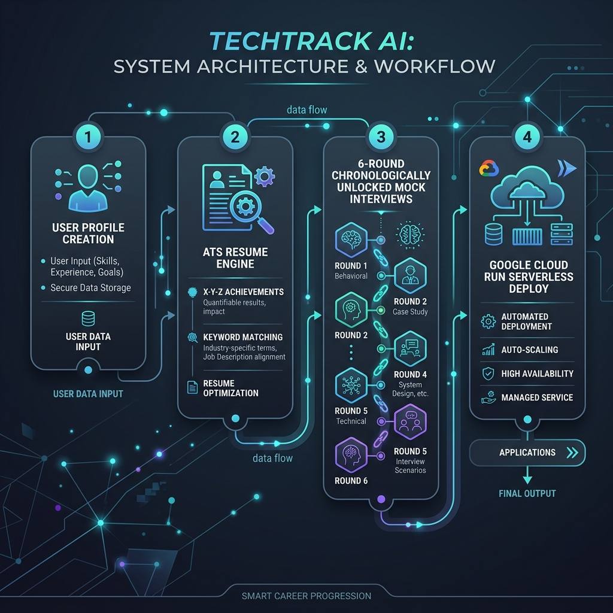

# TechTrack AI - Interview Guide & Resume Builder

TechTrack AI is an AI-powered Full-Stack web application designed to guide candidates from profile completion to ATS-optimized resume building and a structured, 6-round technical interview preparation track tailored to top-tier multi-national corporations (MNCs) and FAANG-tier tech firms.

---

## 📊 System Architecture & Workflow



1. **Candidate Profile Form:** Step-by-step inputs capturing candidate qualifications, job targets, and programming capabilities.
2. **ATS Resume Engine:** Dynamically analyzes keywords, matches gaps, and compiles experience using the Google X-Y-Z formula (`Accomplished X as measured by Y, by doing Z`).
3. **6-Round Technical Mock Interview:** Chronicled preparation track structured around core MNC interview benchmarks (screening, coding assessments, syntax runtimes, frameworks architecture, system design scale, and STAR behavioral criteria).
4. **Google Cloud Run:** Multi-stage production container setup ready for serverless GCP hosting.

---

## 🛠️ Technology Stack

- **Frontend:** React.js, Tailwind CSS, Lucide Icons, Vite
- **Backend:** Node.js, Express, JWT, Bcrypt, Google Generative AI SDK
- **Database:** MongoDB (via Mongoose) / Local JSON file fallback database
- **Deployment:** Docker, Google Cloud Run

---

## 📁 Directory Structure

```
d:/Interview guide and Resume Generator/
├── backend/
│   ├── config/
│   │   └── db.js            # Mongoose connection
│   ├── middleware/
│   │   └── auth.js          # JWT auth validation middleware
│   ├── models/
│   │   └── db.js            # Unified DB models with Mongoose & JSON fallback
│   ├── routes/
│   │   ├── auth.js          # Auth routing (signup, login, verification)
│   │   ├── profile.js       # Profile management endpoints
│   │   ├── resume.js        # AI resume parsing & generation
│   │   └── interview.js     # 6-round technical mock questions
│   ├── services/
│   │   └── gemini.js        # Gemini API client & fallback generator
│   └── server.js            # Entry point for Express API & static client hosting
├── frontend/
│   ├── src/
│   │   ├── components/
│   │   │   ├── Auth.jsx             # User Login / Sign Up UI
│   │   │   ├── ThemeToggle.jsx      # Dark/Light mode selector
│   │   │   ├── MultiStepForm.jsx    # Multi-Step Candidate Form
│   │   │   ├── ResumeViewer.jsx     # ATS resume renderer & print engine
│   │   │   ├── InterviewTrack.jsx   # Gamified 6-Round interview guide
│   │   │   └── DashboardStats.jsx   # Dashboard KPI metric cards
│   │   ├── App.jsx                  # State synchronization & routing
│   │   ├── index.css                # Zinc global styles
│   │   └── main.jsx
│   ├── tailwind.config.js
│   ├── postcss.config.js
│   └── vite.config.js
├── Dockerfile               # Multi-stage production container setup
└── README.md                # Deployment and running guide
```

---

## 🚀 Local Development Setup

To run the application locally, you will need Node.js (v18+) installed.

### 1. Backend Setup
1. Open a terminal and navigate to the backend directory:
   ```bash
   cd backend
   ```
2. Install dependencies:
   ```bash
   npm install
   ```
3. Create a `.env` file (copied from `.env.example`):
   ```bash
   copy .env.example .env
   ```
4. (Optional) Provide your `GEMINI_API_KEY` and `MONGO_URI`. If left blank, the server automatically defaults to local JSON storage (`backend/data/db_local_backup.json`) and the template fallback AI logic.
5. Start the backend server:
   ```bash
   npm start
   ```
   The backend will run at `http://localhost:8080`.

### 2. Frontend Setup
1. Open another terminal and navigate to the frontend directory:
   ```bash
   cd frontend
   ```
2. Install dependencies:
   ```bash
   npm install
   ```
3. Start the Vite dev server:
   ```bash
   npm run dev
   ```
   The frontend dev server will launch at `http://localhost:5173`. Vite will proxy `/api` requests to the Node backend.

---

## ☁️ Google Cloud Platform (GCP) Deployment

The application is structured to deploy to **Google Cloud Run** using a containerized multi-stage Docker build.

### Build & Deploy using Cloud Build
1. In the root directory (where the `Dockerfile` is located), compile the container image:
   ```bash
   gcloud builds submit --tag gcr.io/YOUR_GCP_PROJECT_ID/techtrack-ai:latest
   ```
2. Deploy the container on Cloud Run:
   ```bash
   gcloud run deploy techtrack-ai \
     --image gcr.io/YOUR_GCP_PROJECT_ID/techtrack-ai:latest \
     --platform managed \
     --allow-unauthenticated \
     --set-env-vars GEMINI_API_KEY=YOUR_GEMINI_API_KEY \
     --region us-central1
   ```
3. Copy the service URL returned in the terminal and load it in your browser.
